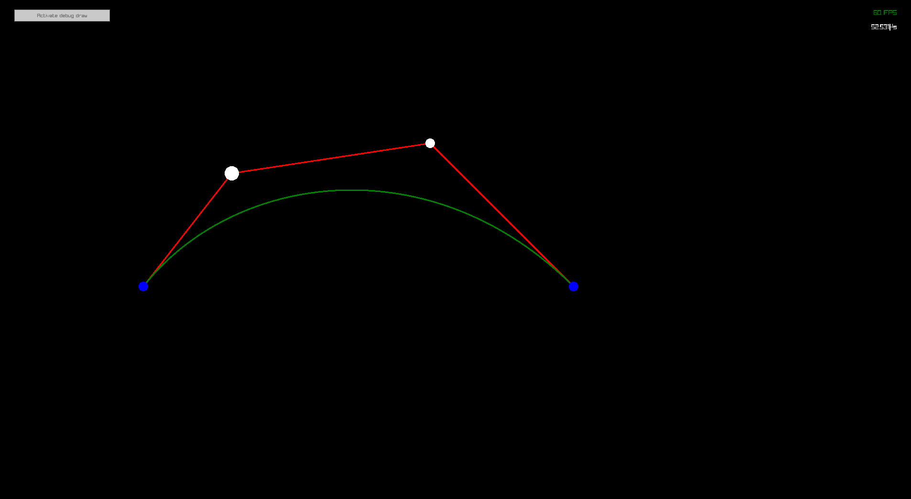

# Spline drawer

This is a small projet around RUST, WASM and spline. The idea of this experiment came to me after seeing this [incredible video](https://www.youtube.com/watch?v=SO83KQuuZvg). I wanted to test rendering (in an interactable way) Bézier curve and Bérzier spline using a homemade raylib project.

## Why use Raylib

At first, I try setting up a version with the [Bevy game engine](https://github.com/bevyengine/bevy) for rust. However, I was felling like it was way too much for handling such a simple project. I then move to Raylib for a more lightweight experience. It is also important to note that Raylib is also well portable to WASM which became part of the project. In fact, by being able to compile to WASM the entire project it is way more convinient for people to test it using the Github Pages website.

## Features

Well, if you have read until here, I will assume that you are kind of interesting in that project. Here is a quick list of the features and key binding:

- Bézier curve (from 2 to 62 control points)
    - Use `SPACE` to add a new control point at the mouse position.
    - Use `BACKSPACE` to remove the last control point.
    - Use the GUI to play with the settings of the visualization.
